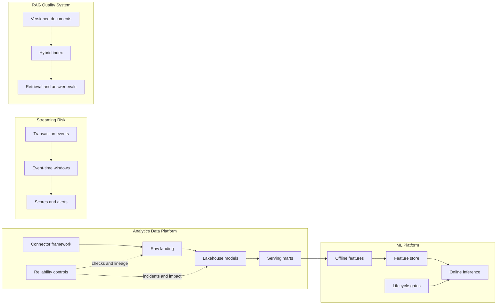

# Data and ML Systems Portfolio

Seven local-first engineering projects covering analytics data platforms, ML
systems, model operations, data reliability, RAG evaluation, streaming risk,
and ELT connectors.

These are production-style portfolio projects, not production systems. They use
deterministic synthetic data to make correctness and failure behavior easy to
review. The production technologies shown in diagrams are either exercised by
the demo or labelled as a migration path.

## Verified Portfolio Status

Audited locally on 10 July 2026:

- all seven documented workflows complete successfully
- 46 domain tests pass across the portfolio
- every project has a reproducible local workflow and dashboard artifact
- every project has a Compose topology, but several external services are not
  yet used by the core workflow
- only the MLOps Lifecycle repository currently has public CI

That last point matters. The projects are credible local demonstrations, but the
portfolio is not yet ready to present all seven as equally mature systems.

## Run The Portfolio Contract

Clone the index with its referenced repositories, then run every domain suite:

```bash
git clone --recurse-submodules \
  https://github.com/kevinmeix1/data-ml-engineering-portfolio.git
cd data-ml-engineering-portfolio
make test
```

The child projects remain independent repositories. The index stores commit
pointers, not duplicate copies of their history.

## Start Here

The three projects below are the best flagship candidates. Each still has a
specific hardening gate before it should be pinned as finished work.

| Candidate | Best Evidence | Hardening Gate | Repository |
| --- | --- | --- | --- |
| Lakehouse Data Platform | Medallion and dimensional models, idempotent ingestion, reconciliation, backfills, lineage | Run one real service-backed path and add CI | [GitHub](https://github.com/kevinmeix1/lakehouse-data-platform) |
| Feature Store and Inference | Point-in-time joins, offline/online parity, late-event and rollback tests | Fix demo freshness/event-time behavior and make the API container long-running | [GitHub](https://github.com/kevinmeix1/feature-store-inference) |
| RAG Evaluation Pipeline | Versioned ingestion, hybrid retrieval, citations, evaluation reports, runnable API | Replace the three-document fixture with a meaningful corpus and golden set | [GitHub](https://github.com/kevinmeix1/rag-evaluation-pipeline) |

Use the remaining projects as targeted evidence rather than presenting them as
four more flagships.

| Project | Use It For | Recommended Disposition | Repository |
| --- | --- | --- | --- |
| Streaming Fraud and Anomaly | Event-time semantics, watermarks, DLQ, replay, alert deduplication | Keep for streaming roles; call it a simulator until Kafka/Flink is exercised | [GitHub](https://github.com/kevinmeix1/streaming-fraud-anomaly) |
| Data Observability and Lineage | Contracts, incidents, root-cause classification, impact analysis | Integrate its best controls into the Lakehouse story; keep unpinned meanwhile | [GitHub](https://github.com/kevinmeix1/data-observability-lineage) |
| ELT Connector Framework | Incremental state, pagination, retry, drift, quarantine | Integrate one connector with the Lakehouse raw layer; keep as a focused lab | [GitHub](https://github.com/kevinmeix1/elt-connector-framework) |
| MLOps Lifecycle | Deterministic training, evaluation gates, registry, rollback | Merge its lifecycle controls into the ML platform story; avoid duplicate serving claims | [GitHub](https://github.com/kevinmeix1/mlops-lifecycle-platform) |

## Portfolio Architecture



The diagram is a portfolio map, not a claim that the repositories currently run
as one distributed deployment.

## Role-Based Path

| Role | Lead With | Supporting Evidence |
| --- | --- | --- |
| Data Engineering | Lakehouse | ELT, Observability, Streaming Fraud |
| ML Engineering | Feature Store | MLOps Lifecycle, Lakehouse |
| MLOps | Feature Store plus MLOps Lifecycle as one story | Observability, Streaming Fraud |
| AI/LLM Systems | RAG Evaluation | Observability, Lakehouse |
| Solution Architecture | Lakehouse | Feature Store, Observability, ELT |

Do not put all seven projects on one CV. Select two or three that match the role
and be prepared to explain one failure mode in depth.

## Recruiter Summary

I built a set of local-first data and ML systems to demonstrate the engineering
decisions behind production platforms: temporal correctness, data contracts,
idempotency, evaluation gates, lineage, failure recovery, observability, and
clear operating boundaries. The projects are deliberately runnable with
synthetic data and explicitly distinguish implemented behavior from production
migration options.

## Shared Engineering Contract

Every project is converging on the same public interface:

```bash
make demo          # deterministic end-to-end local workflow
make test          # unit, contract, failure, and workflow tests
make lint          # static quality checks
make typecheck     # real type checker, not a compile alias
make compose-up    # integrated service-backed mode
make compose-smoke # health and behavior checks against running services
make clean         # remove generated local state
```

Each README must include an implementation matrix with three columns:

- **Local:** code exercised by `make demo` and tests
- **Integrated:** code exercised against Compose services
- **Production mapping:** design notes only

This prevents a Kafka, MLflow, Qdrant, Redis, Airflow, or Marquez container from
being mistaken for an integration merely because it appears in Compose.

See the full [Shared Engineering Standard](docs/shared-engineering-standard.md).

## Portfolio Guides

- [Senior Mentor Review](docs/portfolio-mentor-review.md)
- [Shared Engineering Standard](docs/shared-engineering-standard.md)
- [Interview Guide](docs/interview-guide.md)
- [Evidence-Safe CV Bullets](docs/cv-bullets.md)
- [Improvement Roadmap](docs/roadmap.md)

## Honest Positioning

Use **production-style local project**, **deterministic simulator**, or
**service-backed demo** when those phrases are accurate. Avoid
**production-grade**, **enterprise platform**, and **real-time system** unless
the repository contains evidence for those claims under realistic operating
conditions.

The senior signal is not the number of tools in a diagram. It is knowing which
guarantee matters, proving it with a test, showing what happens when it fails,
and naming what remains before production.
